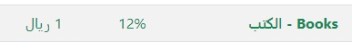
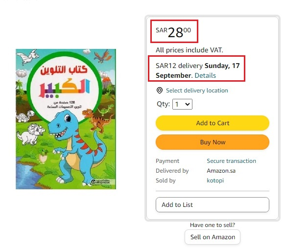
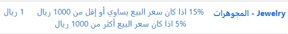
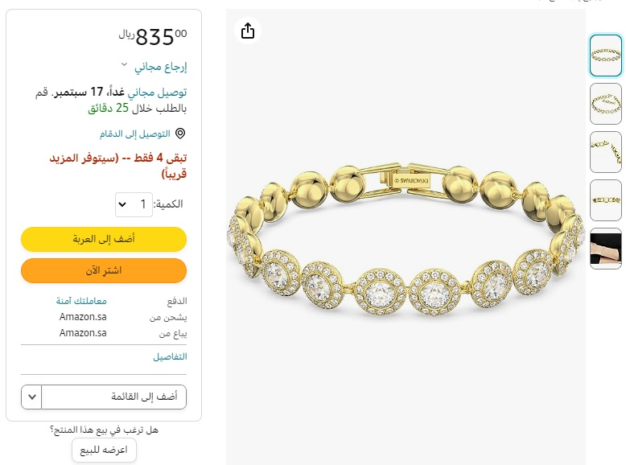
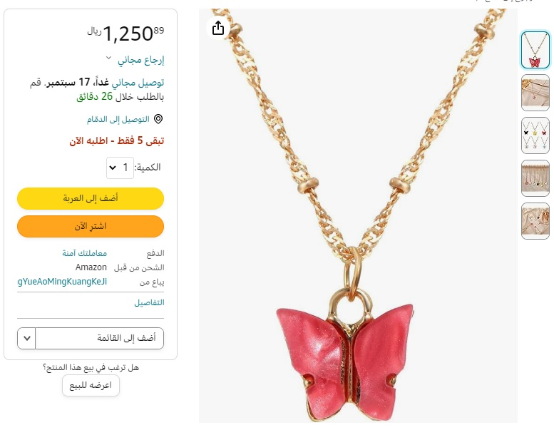

[أدوات البائعين](#)

*   [حاسبة امازون السعودية](https://www.4sellers.top "أحسب عمولة البيع على امازون السعودية")
*   [شروحات البيع على امازون](#)
    *   [عمولة البيع على امازون](https://www.4sellers.top/learning/Category_Referral_Fees.php)
    *   [رسوم التوصيل](https://www.4sellers.top/learning/shipping_charges.php)
    *   [طريقة أحتساب أوزان وأبعاد الشحنة](#)
*   [السجلات التجارية بالسعودية](#)
    *   [عرض الكل](https://www.4sellers.top/cr/all.php)
    *   [الباحة](https://www.4sellers.top/cr/AlBaha.php)
    *   [الجوف](https://www.4sellers.top/cr/AlJawf.php)
    *   [المدينة المنورة](https://www.4sellers.top/cr/AlMadinahAlMunawwarah.php)
    *   [القصيم](https://www.4sellers.top/cr/AlQassim.php)
    *   [الرياض](https://www.4sellers.top/cr/ArRiyadh.php)
    *   [عسير](https://www.4sellers.top/cr/Asir.php)
    *   [الشرقية](https://www.4sellers.top/cr/Eastern.php)
    *   [حائل](https://www.4sellers.top/cr/Hail.php)
    *   [جازان](https://www.4sellers.top/cr/Jazan.php)
    *   [مكة المكرمة](https://www.4sellers.top/cr/MakkahAlMukarramah.php)
    *   [نجران](https://www.4sellers.top/cr/Najran.php)
    *   [الحدود الشمالية](https://www.4sellers.top/cr/NorthernFrontier.php)
    *   [تبوك](https://www.4sellers.top/cr/Tabuk.php)
    *   [أخرى](https://www.4sellers.top/cr/other.php)

أفضل الأدوات لمساعدة البائعين على امازون

* * *

أدوات البائعين
==============

  

عمولة البيع
===========

  

##### أنواع عمولات البيع على امازون السعودية

*     
    
    يتم احتساب عمولة البيع على امازون من السعر البيع زائد [رسوم التوصيل](https://www.4sellers.top/learning/shipping_charges.php "أعرف أكثر عن رسوم التوصيل") التي يتم تحصيلها من العميل بحسب القسم الخاص بالمنتج
    
    بحد أدنى عمولة 1 ريال ماعدا قسم البقالة لايوجد حد ادنى.
    
      
    
    هناك نوعين رئيسين لطريقة إحتساب العمولات
    
    1.  عمولة ثابتة \[تم تحديدها باللون الأخضر في [جدول العمولات](#1)\]
    2.  عمولة متغيرة بحسب السعر \[تم تحديدها باللون الأزرق في [جدول العمولات](#1)\]
    
    *   عمولة متغيرة أقل من حد السعر الأعلى
    *   عمولة متغيرة أكثر من حد السعر الأعلى
    
      
      
    
    * * *
    
      
      
    
    * * *
    

  

##### العمولة الثابتة

*     
    
    ##### أمثلة على العمولة الثابتة
    
    مثال: عمولة ثابتة
    
    أخترنا قسم الكتب كمثال لتطبيق نسبة عمولة البيع على أمازون 12% كما هو موضح في جدول العمولات
    
      
      
      
    
      
      
    
    
    
    ##### هنا مثال لكتاب التلوين الكبير معروض للبيع على أمازون
    
    سعر البيع: 28 ريال
    
    رسوم التوصيل: 12 ريال
    
    الإجمالي: 40 ريال
    
    طريقة الحساب:
    
    40 ريال (اجمالي قيمة المنتج) - 4.8 ريال (12% عمولة أمازون لقسم الكتب) - 0.72 ريال (ضريبة العمولة) =
    
    34.48 ريال (الربح من بيع الكتاب)
    
    غير شامل رسوم الشحن للعميل | سيتم خصم رسوم الشحن السهل أو رسوم تخزين FBA
    

  

##### العمولة المتغيرة بحسب السعر

*     
    
    ##### أمثلة على العمولة متغيرة بحسب السعر
    
    هناك نوعين من العمولات المتغيرة بحسب السعر
    
    *   عمولة متغيرة أقل من حد السعر الأعلى
    *   عمولة متغيرة أكثر من حد السعر الأعلى
    
    العمولات المتغيرة بحسب السعر يتم احتساب نسبة العمولة بناء على سعر المنتج
    
      
    
    
    
    ##### مثال: عمولة متغيرة بحسب السعر
    
    أخترنا قسم المجوهرات لتطبيق نسبة عمولة البيع على أمازون 15% لسعر المنتج 1000 ريال أو أقل
    
    وتطبيق 5% لأكثر من 1000 ريال
    
    
    
    ##### هنا مثال لسوارة نسائي لسعر أقل من الحد الأعلى
    
    سعر البيع: 835 ريال
    
    رسوم التوصيل: 0 ريال (مجاني)
    
    الإجمالي: 835 ريال
    
    طريقة الحساب:
    
    835 ريال (اجمالي قيمة المنتج) - 125.25 ريال (15% عمولة أمازون لقسم المجوهرات) - 18.79 ريال (ضريبة العمولة) =
    
    690.96 ريال (الربح من بيع السوارة)
    
    غير شامل رسوم الشحن للعميل | سيتم خصم رسوم الشحن السهل أو رسوم تخزين FBA
    
    
    
    ##### هنا مثال لقلادة نسائي لسعر أعلى من الحد الأعلى
    
    سعر البيع: 1250 ريال
    
    رسوم التوصيل: 0 ريال (مجاني)
    
    الإجمالي: 1250 ريال
    
    طريقة الحساب:
    
    1250 ريال (اجمالي قيمة المنتج) - 62.5 ريال (5% عمولة أمازون لقسم المجوهرات) - 9.38 ريال (ضريبة العمولة) =
    
    1178.12 ريال (الربح من بيع القلادة)
    
    غير شامل رسوم الشحن للعميل | سيتم خصم رسوم الشحن السهل أو رسوم تخزين FBA
    
      
      
      
    

  

##### قائمة عمولات امازون بحسب القسم

*     
      
    
    القسم الخاص بالمنتج
    
    العمولة
    
    الحد الأدنى للعمولة
    
    Apparel - الملابس
    
    15%
    
    1 ريال
    
    Automotive - السيارات
    
    10%
    
    1 ريال
    
    Baby - منتجات الأطفال
    
    8% اذا كان سعر البيع يساوي أو إقل من 50 ريال  
    15% اذا كان سعر البيع أكثر من 50 ريال
    
    1 ريال
    
    Beauty - الجمال
    
    9%
    
    1 ريال
    
    Books - الكتب
    
    12%
    
    1 ريال
    
    Camera - الكاميرا
    
    8%
    
    1 ريال
    
    Consumer Electronics - إلكترونيات المستهلك
    
    5%
    
    1 ريال
    
    Electronics Accessories - الإكسسوارات الإلكترونية
    
    13% اذا كان سعر البيع يساوي أو إقل من 250 ريال  
    8% اذا كان سعر البيع أكثر من 250 ريال
    
    1 ريال
    
    Furniture - الأثاث
    
    15% اذا كان سعر البيع يساوي أو إقل من 750 ريال  
    10% اذا كان سعر البيع أكثر من 750 ريال
    
    1 ريال
    
    Gift Cards - بطاقات الهدايا
    
    10%
    
    1 ريال
    
    Grocery - البقالة
    
    3% اذا كان سعر البيع يساوي أو إقل من 25 ريال  
    9% اذا كان سعر البيع أكثر من 25 ريال
    
    0 ريال
    
    Health & Personal Care - الصحة والعناية الشخصية
    
    8% اذا كان سعر البيع يساوي أو إقل من 50 ريال  
    12% اذا كان سعر البيع أكثر من 50 ريال
    
    1 ريال
    
    Home - المنزل
    
    11%
    
    1 ريال
    
    Jewelry - المجوهرات
    
    15% اذا كان سعر البيع يساوي أو إقل من 1000 ريال  
    5% اذا كان سعر البيع أكثر من 1000 ريال
    
    1 ريال
    
    Kitchen - المطبخ
    
    11%
    
    1 ريال
    
    Luggage - الأمتعة
    
    15%
    
    1 ريال
    
    Major appliances - الأجهزة المنزلية الرئيسية
    
    6%
    
    1 ريال
    
    Mobile Phones - الهواتف المحمولة
    
    5%
    
    1 ريال
    
    Music - الموسيقى
    
    15%
    
    1 ريال
    
    Music instruments - الآلات الموسيقية
    
    15%
    
    1 ريال
    
    Office products - المنتجات المكتبية
    
    15%
    
    1 ريال
    
    Outdoor - منتجات الأنشطة الخارجية
    
    11%
    
    1 ريال
    
    PC store - أجهزة الكمبيوتر الشخصية
    
    5%
    
    1 ريال
    
    Perfumes - العطور
    
    15%
    
    1 ريال
    
    Personal care Appliances - أجهزة العناية الشخصية
    
    8% اذا كان سعر البيع يساوي أو إقل من 50 ريال  
    11% اذا كان سعر البيع أكثر من 50 ريال
    
    1 ريال
    
    Pet Products - مستلزمات الحيوانات الأليفة
    
    15%
    
    1 ريال
    
    Shoes - الأحذية
    
    15%
    
    1 ريال
    
    Small Appliances - الأجهزة الصغيرة
    
    10%
    
    1 ريال
    
    Sports - الرياضة
    
    10%
    
    1 ريال
    
    Stamps collectibles - مقتنيات الطوابع العتيقة
    
    10%
    
    1 ريال
    
    Tools & Home Improvement - الأدوات ومعدات تطوير المنزل
    
    12%
    
    1 ريال
    
    Toys - اللعب
    
    11%
    
    1 ريال
    
    Video & DVD - الفيديو والدي في دي (DVD)
    
    10%
    
    1 ريال
    
    Video Game Consoles - أجهزة التحكم في ألعاب الفيديو
    
    5%
    
    1 ريال
    
    Video Games - ألعاب الفيديو
    
    12%
    
    1 ريال
    
    Watches - الساعات
    
    15% اذا كان سعر البيع يساوي أو إقل من 5000 ريال  
    5% اذا كان سعر البيع أكثر من 5000 ريال
    
    1 ريال
    
    Wireless - الأجهزة اللاسلكية
    
    13% اذا كان سعر البيع يساوي أو إقل من 250 ريال  
    8% اذا كان سعر البيع أكثر من 250 ريال
    
    1 ريال
    
    All Other Categories - جميع الفئات الأخرى
    
    10%
    
    1 ريال
    
      
    [مركز المساعدة للتفاصيل](https://sellercentral.amazon.sa/help/hub/reference/external/G200336920)  
      
      
    

  
(adsbygoogle = window.adsbygoogle || \[\]).push({});  
#myBtn { display: none; /\* Hidden by default \*/ position: fixed; /\* Fixed/sticky position \*/ bottom: 20px; /\* Place the button at the bottom of the page \*/ right: 30px; /\* Place the button 30px from the right \*/ z-index: 99; /\* Make sure it does not overlap \*/ border: none; /\* Remove borders \*/ outline: none; /\* Remove outline \*/ background-color: black; /\* Set a background color \*/ color: white; /\* Text color \*/ cursor: pointer; /\* Add a mouse pointer on hover \*/ padding: 15px; /\* Some padding \*/ border-radius: 10px; /\* Rounded corners \*/ font-size: 18px; /\* Increase font size \*/ } #myBtn:hover { background-color: #555; /\* Add a dark-grey background on hover \*/ } الأعلى // Get the button let mybutton = document.getElementById("myBtn"); // When the user scrolls down 20px from the top of the document, show the button /\* window.onscroll = function() {scrollFunction()}; function scrollFunction() { if (document.body.scrollTop > 20 || document.documentElement.scrollTop > 20) { mybutton.style.display = "block"; } else { mybutton.style.display = "none"; } } \*/ // When the user clicks on the button, scroll to the top of the document function topFunction() { document.body.scrollTop = 0; document.documentElement.scrollTop = 0; }  

  Contains information from 
                            ([Commercial Registration](https://od.data.gov.sa/Data/en/dataset/commercial-registration))
   which is made available under the 
                            ([ODC Attribution License](https://od.data.gov.sa/downloads/booklet/policies/Open%20Data%20License_En.pdf))

  

❤ Built with

[

By

](https://github.com/alsobihi/Amazon_Calculator)

[Privacy Policy](https://4sellers.top/Privacy_Policy.html)  
[Terms of Service](https://4sellers.top/Privacy_Policy.html)
