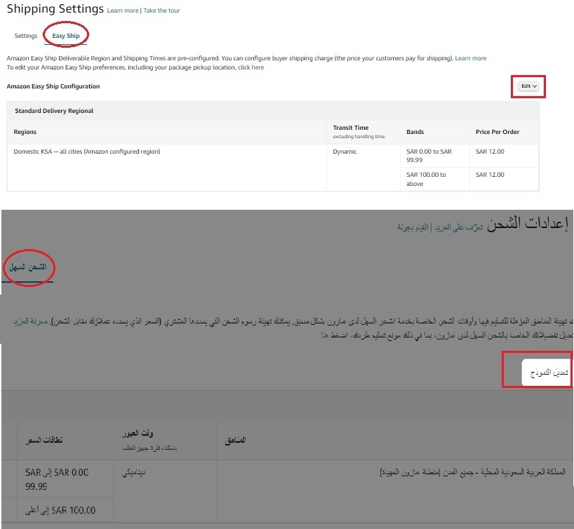

[أدوات البائعين](#)

*   [حاسبة امازون السعودية](https://www.4sellers.top "أحسب عمولة البيع على امازون السعودية")
*   [شروحات البيع على امازون](#)
    *   [عمولة البيع على امازون](https://www.4sellers.top/learning/Category_Referral_Fees.php)
    *   [رسوم التوصيل](https://www.4sellers.top/learning/shipping_charges.php)
    *   [طريقة أحتساب أوزان وأبعاد الشحنة](#)
*   [السجلات التجارية بالسعودية](#)
    *   [عرض الكل](https://www.4sellers.top/cr/all.php)
    *   [الباحة](https://www.4sellers.top/cr/AlBaha.php)
    *   [الجوف](https://www.4sellers.top/cr/AlJawf.php)
    *   [المدينة المنورة](https://www.4sellers.top/cr/AlMadinahAlMunawwarah.php)
    *   [القصيم](https://www.4sellers.top/cr/AlQassim.php)
    *   [الرياض](https://www.4sellers.top/cr/ArRiyadh.php)
    *   [عسير](https://www.4sellers.top/cr/Asir.php)
    *   [الشرقية](https://www.4sellers.top/cr/Eastern.php)
    *   [حائل](https://www.4sellers.top/cr/Hail.php)
    *   [جازان](https://www.4sellers.top/cr/Jazan.php)
    *   [مكة المكرمة](https://www.4sellers.top/cr/MakkahAlMukarramah.php)
    *   [نجران](https://www.4sellers.top/cr/Najran.php)
    *   [الحدود الشمالية](https://www.4sellers.top/cr/NorthernFrontier.php)
    *   [تبوك](https://www.4sellers.top/cr/Tabuk.php)
    *   [أخرى](https://www.4sellers.top/cr/other.php)

أفضل الأدوات لمساعدة البائعين على امازون

* * *

أدوات البائعين
==============

  

رسوم التوصيل
============

##### ماهو رسوم التوصيل؟

*     
    **رسوم اختيارية تسمح أمازون لك في إضافتها على قيمة الطلب بحد ادنى 0 وبحد أعلى 12 ريال للطلب**  
    
    
    
    ##### هنا مثال لرسوم التوصيل يتم تحصيلها من العميل
    
    سعر المنتح: 47.99 ريال
    
    رسوم التوصيل: 12 ريال
    
    اجمالي سعر الطلب: 59.99 ريال
    

  

##### كيف طريقة تعديل رسوم التوصيل؟

*     
    **أذهب من صفحة البائع الإعدادات .> اعدادات الشحن .>الشحن السهل .> تعديل النموذج يمكنك هنا تحديد قيمة التوصيل أو جعل التوصيل مجاناً للعميل**  
      
      
    
    
    
    ##### الخطوة الأولى:
    
    الضغط على أيقونة الإعدادات
    
    أختيار اعدادات الشحن من القائمة
    
      
      
    
    
    
    ##### الخطوة الثانية:
    
    أختيار الشحن السهل
    
    أختيار ايقونة التعديل على خيارات الشحن السهل
    

  

##### اعدادات الشحن

*     
      
    
    1.  تأكد من تفعيل خدمة الشحن السهل فقط !
    2.  تأكد من عنوان المستودع قبل البيع
    3.  تأكد من مقدرتك على تجهيز الطلب في نفس اليوم أو يومين بحد أقصى وقم بتحديد المدة من الاعدادات العامة
    
    [مركز المساعدة للتفاصيل](https://sellercentral.amazon.sa/help/hub/reference/201856140)  
      
      
    

  

  Contains information from 
                            ([Commercial Registration](https://od.data.gov.sa/Data/en/dataset/commercial-registration))
   which is made available under the 
                            ([ODC Attribution License](https://od.data.gov.sa/downloads/booklet/policies/Open%20Data%20License_En.pdf))

  

❤ Built with

[

By

](https://github.com/alsobihi/Amazon_Calculator)

[Privacy Policy](https://4sellers.top/Privacy_Policy.html)  
[Terms of Service](https://4sellers.top/Privacy_Policy.html)
